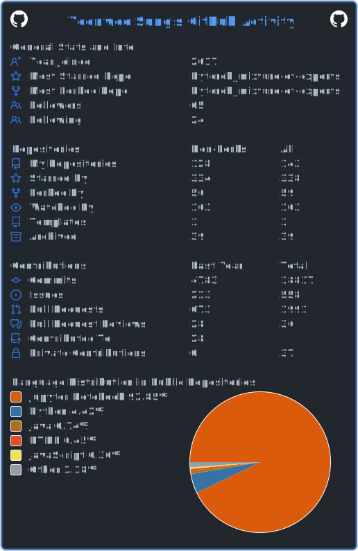

# Yeonwoo Sung

## Skills

<h3 align="center">📚 Tech Stack 📚</h3>

  </a>&nbsp 
  </a>&nbsp
  </a>&nbsp
  </a>&nbsp
   
  </a>&nbsp 
  </a>&nbsp
  </a>&nbsp 
  </a>&nbsp

## Kaggle

Kaggle Competition Expert

## Education

BSc in University of St Andrews (2016 - 2020)

NVIDIA, Deep Learning NLP certificate (2019)

NVIDIA, Rapid Application Development with Large Language Models (2024)

Coursera - Machine Learning, Certification for ”Machine Learning” course (2018)

## Awards

- Dean’s List for academic excellence in the academic year 2019/20
- Medal for performance in Programming Projects module (2018)
